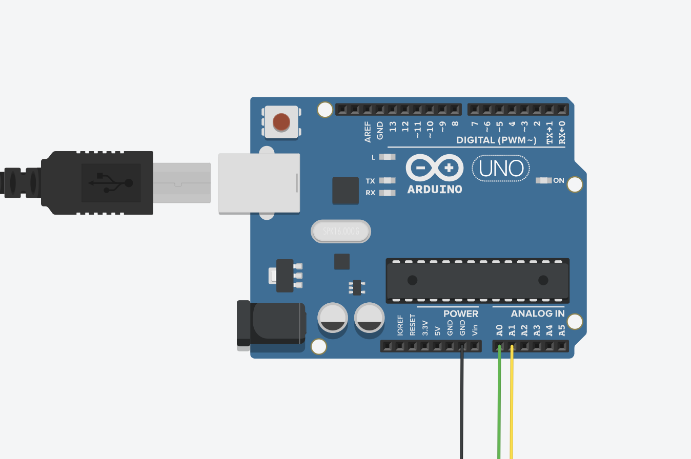

# Project Name/Arduino Controlled Pong
Hey Guys!.This is a pong processing game which you can play with friends.All you need is your brawn,arduino board and your laptop.

| **Engineer** | **School** | **Area of Interest** | **Grade** |
|:--:|:--:|:--:|:--:|
| Brianna Malm | International Community School | Mechanical/Aerospace Engineering | Incoming Senior

# Final Milestone
To connect my Arduino board, I had to import processing serial into the pong game and making sure we have the device number in the code.So now the wires control the left side of the game and the other side is controlled by the keyboard.The successful game has been made!.

<iframe width="650" height="365" src="https://www.youtube.com/embed/FmGTrq9Gdn4" title="YouTube video player" frameborder="0" allow="accelerometer; autoplay; clipboard-write; encrypted-media; gyroscope; picture-in-picture" allowfullscreen></iframe>

# Second Milestone
After launching the Arduino App, I created an input test.I made sure my arduino board was connected to my laptop using a dongle and jumper wires.When it was connected , we had to make sure three jumper wire all on the same side were connected to the board.To GND,A0,A1.It was first connected to 5V but when it was I didn't get results so it had to be changed.
The other side of the wires will serve as a control when they touch.When A0 is touching the GND wire its up and A1 is zero.I used a serial monitor to make sure I was getting the right values.

<iframe width="650" height="365" src="https://www.youtube.com/embed/6sgyN1Y26Gs" title="YouTube video player" frameborder="0" allow="accelerometer; autoplay; clipboard-write; encrypted-media; gyroscope; picture-in-picture" allowfullscreen></iframe>

# First Milestone
  

My first milestone was getting my processing software working and making the ball move and stay on the screen.I had issues at the beginning of inserting the code because it was just moving in two directions and it needed to be different directions.Then once it was in different directions it didn't want to stay on the screen.It disappeared once the game started.However I was able to fix this issue.After I had gotten paddles on the screen, it was starting to look more like a pong game.However, the ball wasn't affected by the paddles.It seemed to pass right through the padlles.However,the paddles needed to have the ability to stop the ball's movement.After a few adjustments ,it  sucessfully bounced of the paddles and became and effective pong game.

<iframe width="650" height="365" src="https://www.youtube.com/embed/bWMObeQ9i6E" title="YouTube video player" frameborder="0" allow="accelerometer; autoplay; clipboard-write; encrypted-media; gyroscope; picture-in-picture" allowfullscreen></iframe>

# My Documentation

<iframe width="650" height="365" src="https://docs.google.com/document/d/e/2PACX-1vRQZ36k_hEATV59LdjxpppWR23OxuJt6o0mAkSHdQAeUr2nPlcf-7S0dFv2pmuDYceUuCyCpAaNdq1M/pub?embedded=true"></iframe>

# Useful Images

